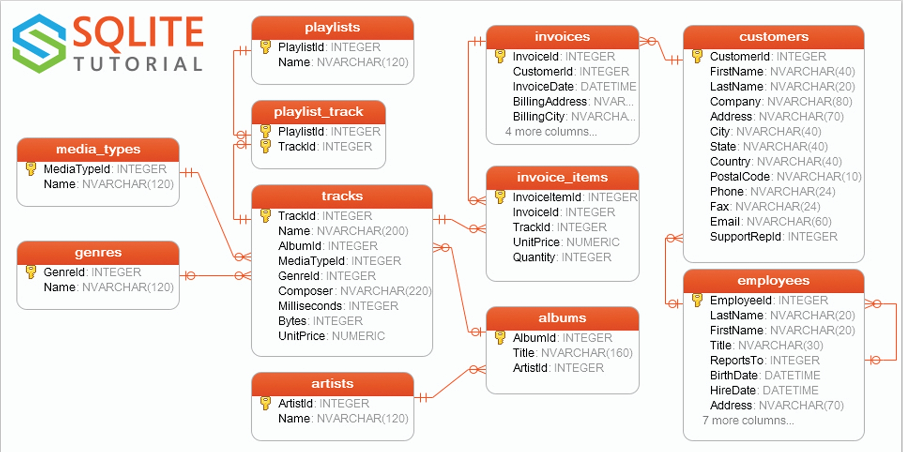

# SQL-Tutorial
We’re going to master SQL using a sample database called Chinook. Through exploring and analyzing data from the Chinook we’ll learn SQL concepts in a fun and engaging way.

[The sample dataset is downloaded from SQLite website](https://www.sqlitetutorial.net/sqlite-sample-database/)
